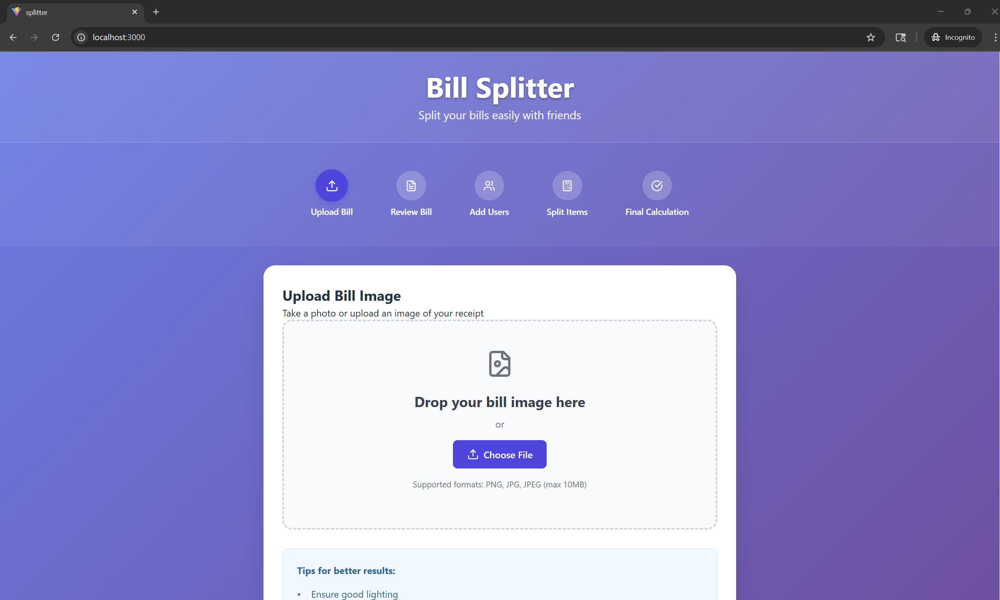
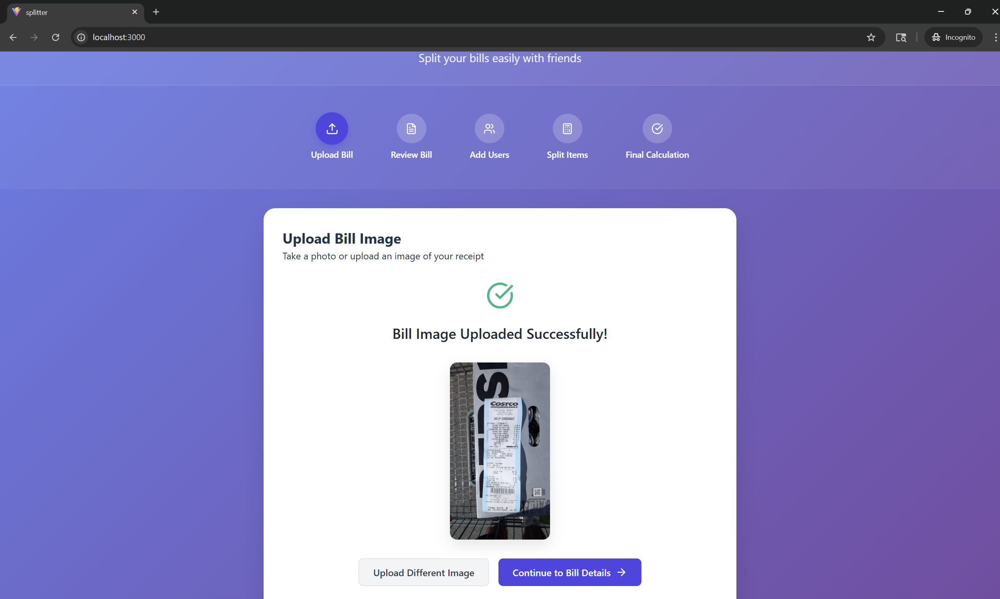
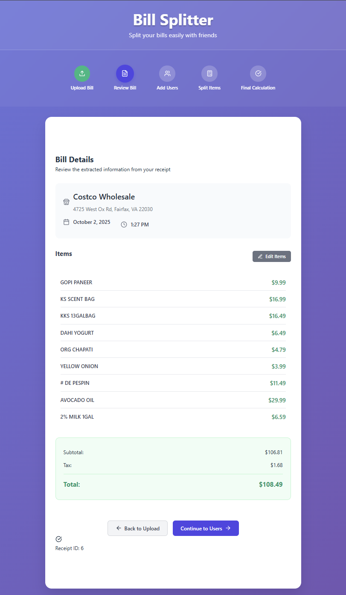
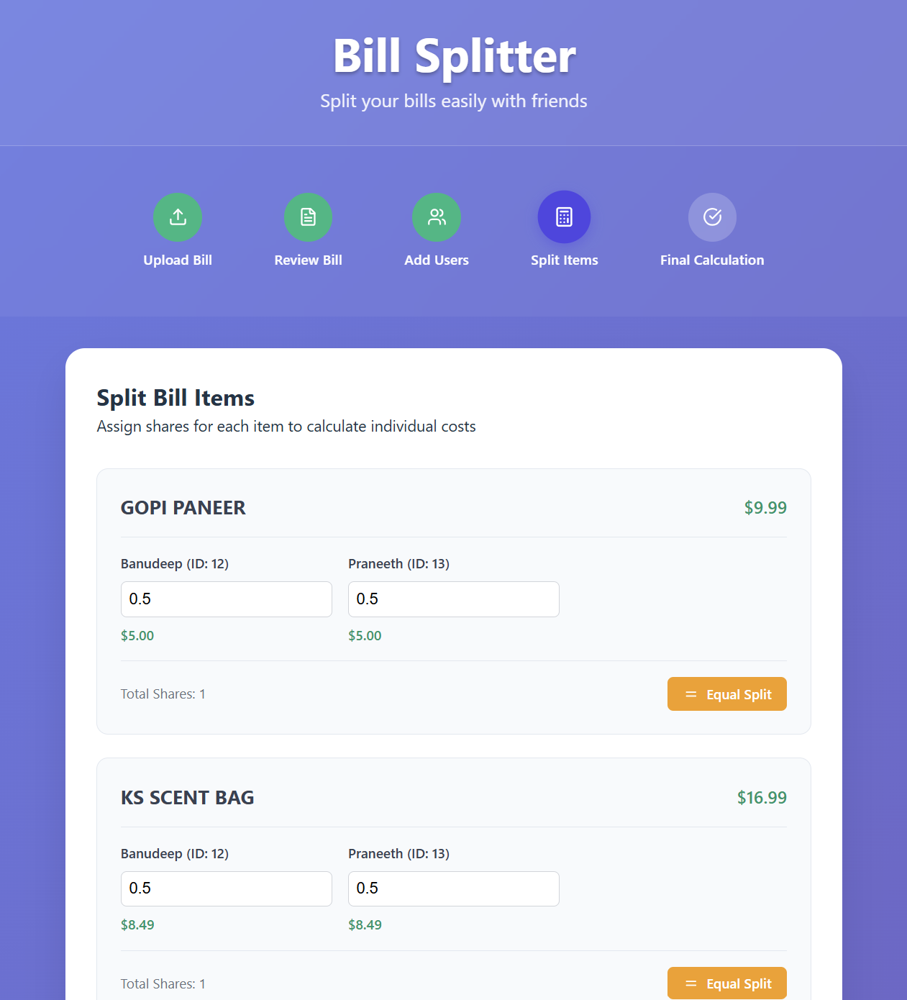
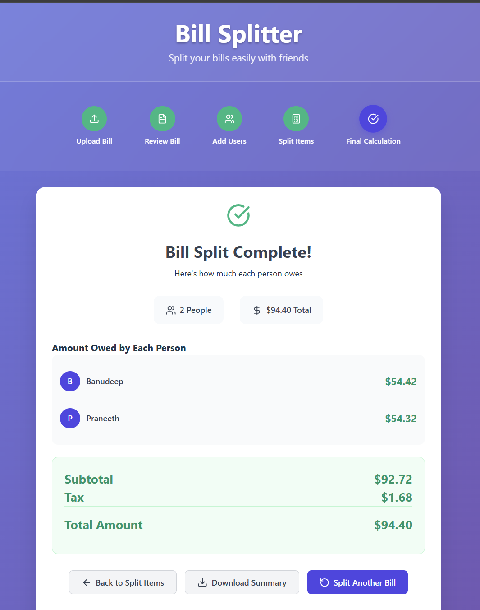

# 💰 Bill Splitter Application

A modern web application for splitting bills with friends using OCR (Optical Character Recognition) technology. Simply upload a photo of your receipt, and the app automatically extracts all items and prices, then helps you split the bill fairly among multiple people.


_Example: Upload a receipt and split it among friends_

---

## 📋 Table of Contents

- [Features](#-features)
- [Architecture](#-architecture)
- [Technology Stack](#-technology-stack)
- [Prerequisites](#-prerequisites)
- [Installation](#-installation)
- [Configuration](#-configuration)
- [Usage Guide](#-usage-guide)
- [Screenshots](#-screenshots)
- [API Documentation](#-api-documentation)
- [Project Structure](#-project-structure)
- [Development](#-development)
- [Troubleshooting](#-troubleshooting)
- [Contributing](#-contributing)
- [License](#-license)

---

## ✨ Features

### Core Features

- **📸 Receipt Upload**: Drag-and-drop or click to upload receipt images (PNG, JPG, JPEG, max 10MB)
- **🔍 Automatic OCR**: Uses OpenAI GPT-4 Vision API to extract text and data from receipt images
- **📋 Bill Review**: Review and edit extracted bill information before splitting
- **👥 User Management**: Add multiple people to split the bill
- **🧮 Smart Splitting**: Assign shares for each item to calculate individual costs automatically
- **💰 Final Calculation**: View how much each person owes with itemized breakdown
- **📥 Export Summary**: Download a text file with the complete bill split summary
- **💾 Data Persistence**: Save bill data to PostgreSQL database for future reference

### Additional Features

- **🔄 Offline Mode**: Automatic fallback to local calculations if backend services are unavailable
- **✅ Error Handling**: Comprehensive error handling with user-friendly messages
- **📱 Responsive Design**: Works on desktop, tablet, and mobile devices
- **🎨 Modern UI**: Clean, intuitive interface with smooth animations

---

## 🏗️ Architecture

The application follows a **3-tier architecture**:

```
┌─────────────────┐
│   React Frontend │  (Port 3000)
│   (Vite + React) │
└────────┬────────┘
         │ HTTP REST API
         │
┌────────▼────────┐
│  Spring Boot API │  (Port 8080)
│   (Java 21)     │
└────────┬────────┘
         │ JDBC
         │
┌────────▼────────┐
│  PostgreSQL DB  │  (Port 5432)
│   (v15-alpine)  │
└─────────────────┘
```

### Components

#### Frontend (`splitter_frontend/`)

- **React 19** - Modern UI framework
- **Vite** - Fast build tool and dev server
- **Axios** - HTTP client for API communication
- **Lucide React** - Icon library

**Main Components:**

- `BillUpload.jsx` - Receipt image upload interface
- `BillDetails.jsx` - Review and edit extracted bill data
- `UserManagement.jsx` - Add/manage users for bill splitting
- `BillSplitting.jsx` - Assign shares and split items
- `FinalCalculation.jsx` - Display final amounts and export summary

#### Backend (`splitter/`)

- **Spring Boot 3.5.6** - RESTful API server
- **Java 21** - Programming language
- **Spring Data JPA** - Database access layer
- **PostgreSQL** - Relational database

**Main Services:**

- `OcrService.java` - Handles OCR processing with OpenAI API
- `SplitService.java` - Manages bill splitting calculations
- `ocrController.java` - REST endpoints for OCR operations
- `splitController.java` - REST endpoints for splitting operations

#### Database

- **PostgreSQL 15** - Stores bills, items, users, and split data

#### External Services

- **OpenAI GPT-4 Vision API** - OCR text extraction from images

---

## 🛠️ Technology Stack

### Frontend

- React 19
- Vite 5.x
- Axios
- Lucide React (Icons)
- CSS3 (Modern styling with gradients)

### Backend

- Spring Boot 3.5.6
- Java 21
- Spring Data JPA
- PostgreSQL Driver
- RestTemplate (HTTP client)

### Database

- PostgreSQL 15 Alpine

### DevOps

- Docker & Docker Compose
- Maven (Build tool)

---

## 📦 Prerequisites

Before you begin, ensure you have the following installed:

### For Docker Deployment (Recommended)

- **Docker Desktop** (latest version)
- **Docker Compose** v3.8 or higher

### For Local Development

- **Java 21** or higher
- **Maven 3.9+**
- **Node.js** v16 or higher
- **npm** or **yarn**
- **PostgreSQL 15** (or use Docker for database only)

### Required Services

- **OpenAI API Key** - Get one from [OpenAI Platform](https://platform.openai.com/api-keys)

---

## 🚀 Installation

### Option 1: Docker Compose (Easiest)

1. **Clone the repository:**

   ```bash
   git clone <repository-url>
   cd splitter
   ```

2. **Create `.env` file:**

   ```bash
   cp .env.example .env
   ```

3. **Edit `.env` and add your OpenAI API key:**

   ```env
   OPENAI_API_KEY=your-openai-api-key-here
   ```

4. **Start all services:**

   ```bash
   docker-compose up -d
   ```

5. **Access the application:**

   - Frontend: http://localhost:3000
   - Backend API: http://localhost:8080
   - Database: localhost:5432

6. **View logs (optional):**

   ```bash
   docker-compose logs -f
   ```

7. **Stop services:**
   ```bash
   docker-compose down
   ```

### Option 2: Local Development

#### 1. Set up Database

**Using Docker (recommended):**

```bash
docker-compose up postgres -d
```

**Or install PostgreSQL locally:**

```sql
CREATE DATABASE splitter;
CREATE USER postgres WITH PASSWORD 'hello';
GRANT ALL PRIVILEGES ON DATABASE splitter TO postgres;
```

#### 2. Set up Backend

```bash
cd splitter

# Set environment variable
# Windows PowerShell:
$env:OPENAI_API_KEY="your-api-key-here"

# Windows CMD:
set OPENAI_API_KEY=your-api-key-here

# Linux/Mac:
export OPENAI_API_KEY=your-api-key-here

# Run the application
mvn spring-boot:run
```

Backend will start at: http://localhost:8080

#### 3. Set up Frontend

```bash
cd splitter_frontend

# Install dependencies
npm install --legacy-peer-deps

# Start development server
npm run dev
```

Frontend will start at: http://localhost:5173

---

## ⚙️ Configuration

### Environment Variables

The application uses environment variables for configuration:

| Variable                     | Description                          | Required | Default                                     |
| ---------------------------- | ------------------------------------ | -------- | ------------------------------------------- |
| `OPENAI_API_KEY`             | OpenAI API key for OCR functionality | Yes      | -                                           |
| `SPRING_DATASOURCE_URL`      | PostgreSQL connection URL            | No       | `jdbc:postgresql://localhost:5432/splitter` |
| `SPRING_DATASOURCE_USERNAME` | Database username                    | No       | `postgres`                                  |
| `SPRING_DATASOURCE_PASSWORD` | Database password                    | No       | `hello`                                     |

### Configuration Files

#### `.env` (Docker Compose)

Create this file in the project root:

```env
OPENAI_API_KEY=your-openai-api-key-here
```

#### `application.properties` (Spring Boot)

Located at `splitter/src/main/resources/application.properties`:

```properties
spring.application.name=splitter
spring.datasource.url=jdbc:postgresql://localhost:5432/splitter
spring.datasource.username=postgres
spring.datasource.password=hello
spring.jpa.hibernate.ddl-auto=update
```

> **Note:** API keys should NEVER be committed to git. Use `.env` files which are automatically ignored.

---

## 📖 Usage Guide

### Step-by-Step Workflow

#### 1. Upload Receipt


_Upload your receipt image here_

- Click "Choose File" or drag and drop your receipt image
- Supported formats: PNG, JPG, JPEG (max 10MB)
- The app will automatically extract information using OCR

**Tips for better OCR results:**

- Ensure good lighting
- Keep the receipt flat
- Make sure all text is visible
- Avoid shadows and glare

#### 2. Review Bill


_Review and edit extracted information_

- Check the extracted store name, address, date, and time
- Verify all items and prices are correct
- Edit any incorrect information
- Click "Next" when ready to proceed

#### 3. Add Users


_Add people who will split the bill_

- Enter names of people splitting the bill
- Optionally pre-assign amounts to specific users
- Click "Add User" for each person
- Click "Save Users" when done

#### 4. Split Items


_Assign shares for each item_

- For each item, assign shares to users (e.g., 0.5 = half, 1 = full item)
- The total shares should equal 1.0 for each item
- Costs are calculated automatically
- Click "Save Splits" when done

#### 5. Final Calculation


_View final amounts and download summary_

- Review how much each person owes
- See itemized breakdown of charges
- Click "Download Summary" to save as text file
- Click "Start New Bill" to process another receipt

### Example Workflow

```
Restaurant Bill: $120.00
├── Pasta ($25.00) - Alice: 0.5, Bob: 0.5
├── Pizza ($30.00) - Bob: 0.6, Charlie: 0.4
├── Salad ($15.00) - Alice: 1.0
├── Drinks ($20.00) - All: 0.33 each
├── Tax ($5.00) - Split equally
└── Tip ($25.00) - Split equally

Final Amounts:
├── Alice: $32.50
├── Bob: $41.70
└── Charlie: $25.80
```

---

## 📸 Screenshots

### Application Overview


_Main application interface with step navigation_

### Receipt Upload


_Drag-and-drop file upload interface_

### OCR Results


_Automatically extracted bill information_

### Bill Splitting


_Interactive item splitting interface_

### Final Summary


_Final calculation results with export option_

### Mobile View


_Responsive design on mobile devices_

---

## 🔌 API Documentation

### OCR Endpoints

#### `POST /ocr/extract`

Extract text and data from receipt image.

**Request:**

- Content-Type: `multipart/form-data`
- Body: `file` (image file)

**Response:**

```json
{
  "storeName": "Restaurant Name",
  "storeAddress": "123 Main St",
  "date": "2024-01-15",
  "time": "18:30",
  "items": [
    { "description": "Pasta", "price": 25.0 },
    { "description": "Pizza", "price": 30.0 }
  ],
  "subTotal": 55.0,
  "taxTotal": 5.5,
  "total": 60.5
}
```

#### `POST /ocr/receipt`

Save bill data to database.

**Request:**

```json
{
  "storeName": "Restaurant Name",
  "storeAddress": "123 Main St",
  "date": "2024-01-15",
  "time": "18:30",
  "items": [...],
  "subTotal": 55.00,
  "taxTotal": 5.50,
  "total": 60.50
}
```

**Response:**

```json
{ "id": 1 }
```

#### `GET /ocr/receipt?id={id}`

Retrieve bill data by ID.

**Response:**

```json
{
  "storeName": "Restaurant Name",
  ...
}
```

### Split Endpoints

#### `POST /math/users`

Add users to bill split.

**Request:**

```json
[
  { "receiptId": 1, "name": "Alice" },
  { "receiptId": 1, "name": "Bob", "amount": 50.0 }
]
```

#### `GET /math/users?receiptId={id}`

Get users for a bill.

#### `POST /math/share?receiptId={id}`

Save bill splits.

**Request:**

```json
[
  {
    "itemId": 1,
    "shares": [
      { "userId": 1, "share": 0.5 },
      { "userId": 2, "share": 0.5 }
    ]
  }
]
```

#### `GET /math/split?receiptId={id}`

Get final calculations.

**Response:**

```json
{
  "users": [
    {"userId": 1, "name": "Alice", "total": 32.50},
    {"userId": 2, "name": "Bob", "total": 41.70}
  ],
  "items": [...]
}
```

---

## 📁 Project Structure

```
splitter/
├── .env                    # Environment variables (not in git)
├── .env.example            # Template for .env file
├── .gitignore             # Git ignore rules
├── docker-compose.yml     # Docker Compose configuration
├── README.md             # This file
├── DOCKER_DEPLOYMENT.md  # Detailed Docker deployment guide
│
├── splitter/              # Backend (Spring Boot)
│   ├── src/
│   │   ├── main/
│   │   │   ├── java/com/example/splitter/
│   │   │   │   ├── controller/    # REST controllers
│   │   │   │   ├── service/       # Business logic
│   │   │   │   ├── model/         # Database entities
│   │   │   │   ├── repo/          # Data repositories
│   │   │   │   └── config/        # Configuration
│   │   │   └── resources/
│   │   │       └── application.properties
│   │   └── test/                  # Unit tests
│   ├── Dockerfile
│   └── pom.xml
│
├── splitter_frontend/     # Frontend (React)
│   ├── src/
│   │   ├── components/   # React components
│   │   ├── services/     # API service layer
│   │   ├── App.jsx
│   │   └── main.jsx
│   ├── Dockerfile
│   └── package.json
│
└── docs/                  # Documentation
    └── images/           # Screenshots and examples
        ├── app-demo.png
        ├── step1-upload.png
        ├── step2-review.png
        ├── step3-users.png
        ├── step4-split.png
        ├── step5-result.png
        └── ...
```

---

## 💻 Development

### Running in Development Mode

#### Backend Development

```bash
cd splitter
export OPENAI_API_KEY=your-key-here  # Linux/Mac
# or set OPENAI_API_KEY in your IDE run configuration

mvn spring-boot:run
```

#### Frontend Development

```bash
cd splitter_frontend
npm install --legacy-peer-deps
npm run dev
```

### Building for Production

#### Backend

```bash
cd splitter
mvn clean package
# Output: target/splitter-0.0.1-SNAPSHOT.jar
```

#### Frontend

```bash
cd splitter_frontend
npm run build
# Output: dist/
```

### Database Migrations

The application uses JPA's `ddl-auto=update` for automatic schema management. For production, consider using Flyway or Liquibase.

---

## 🐛 Troubleshooting

### Common Issues

#### 1. "OpenAI API authentication failed (401)"

**Problem:** Invalid or missing API key.

**Solution:**

- Check your `.env` file has `OPENAI_API_KEY=your-valid-key`
- Verify the API key is active at https://platform.openai.com/api-keys
- Ensure environment variable is set when running locally

#### 2. "Failed to connect to database"

**Problem:** Database is not running or connection string is incorrect.

**Solution:**

```bash
# Check if PostgreSQL is running
docker ps | grep postgres

# Or start it with Docker Compose
docker-compose up postgres -d
```

#### 3. "CORS error" in browser console

**Problem:** Frontend can't connect to backend.

**Solution:**

- Verify backend is running on port 8080
- Check `REACT_APP_API_URL` in frontend configuration
- Ensure CORS is enabled in backend (already configured in `CorsConfig.java`)

#### 4. "Port already in use"

**Problem:** Another application is using the required port.

**Solution:**

```bash
# Find and kill process on port 8080 (Linux/Mac)
lsof -ti:8080 | xargs kill

# Windows
netstat -ano | findstr :8080
taskkill /PID <PID> /F
```

### Getting Help

- Check the [DOCKER_DEPLOYMENT.md](DOCKER_DEPLOYMENT.md) for detailed deployment instructions
- Review error logs: `docker-compose logs -f`
- Check browser console for frontend errors
- Check Spring Boot logs for backend errors

---

## 🤝 Contributing

Contributions are welcome! Please follow these steps:

1. **Fork the repository**
2. **Create a feature branch:** `git checkout -b feature/amazing-feature`
3. **Commit your changes:** `git commit -m 'Add amazing feature'`
4. **Push to the branch:** `git push origin feature/amazing-feature`
5. **Open a Pull Request**

### Development Guidelines

- Follow existing code style
- Write tests for new features
- Update documentation as needed
- Ensure `.env` files are never committed
- Follow semantic commit messages

---

## 📝 License

This project is licensed under the MIT License - see the LICENSE file for details.

---

## 🙏 Acknowledgments

- **OpenAI** - For GPT-4 Vision API used for OCR
- **Spring Boot** - For the robust backend framework
- **React** - For the modern frontend framework
- **PostgreSQL** - For reliable data storage

---

## 📧 Contact

For questions or support, please open an issue on GitHub.

---

**Made with ❤️ for easy bill splitting**
